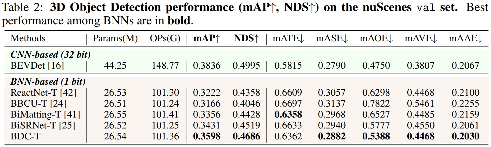

# BDC-Det

## Main Results

<p align="center">
  
</p>


## Get Started

#### Installation and Data Preparation

step 1. Please prepare environment as that in [Docker](docker/Dockerfile) follow [BEVDet](https://github.com/HuangJunJie2017/BEVDet/tree/dev3.0).

step 2. Prepare bevdet repo by.
```shell script
git clone https://github.com/HuangJunJie2017/BEVDet.git
cd BEVDet
pip install -v -e .
```

step 3. Prepare nuScenes dataset as introduced in [nuscenes_det.md](docs/en/datasets/nuscenes_det.md) and create the pkl for BEVDet by running:
```shell
python tools/create_data_bevdet.py
```

#### Train model
```shell
# single gpu
python tools/train.py $config
# multiple gpu
bash ./tools/dist_train.sh $config num_gpu
```

#### Test model
```shell
# single gpu
python tools/test.py $config $checkpoint --eval mAP
# multiple gpu
bash ./tools/dist_test.sh $config $checkpoint num_gpu --eval mAP
```

## Model Zoo

Please download checkpoints from [Google Drive](https://drive.google.com/drive/folders/1mCQcnAgqfijLyiPurekxWcnf9oJ0ZvsZ).