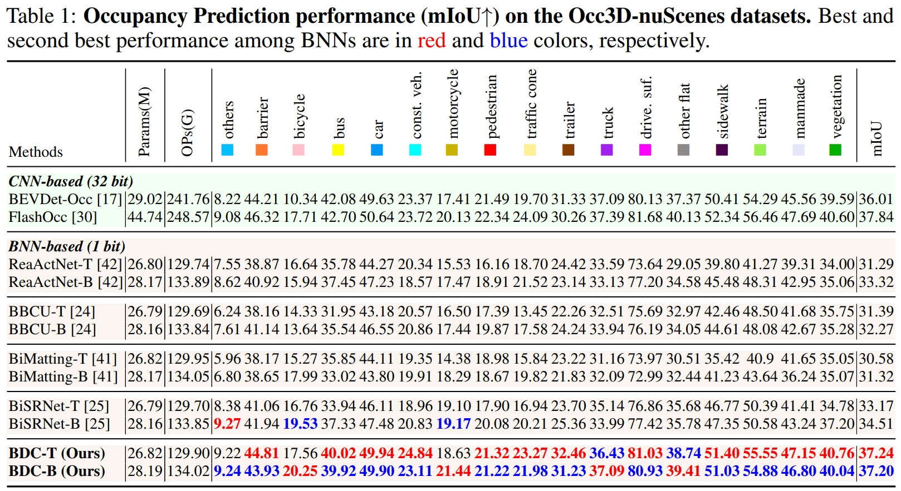

# BDC-Occ: Binarized Deep Convolution Unit For Binarized Occupancy Network

## Main Results

<p align="center">
  
</p>


## Get Started
step 1. Please create environment.
```shell script
conda create -n bdcocc python=3.8
```

step 2. Prepare bdcocc repo by.
```shell script
bash install.sh
```

step 3. Prepare nuScenes dataset as introduced in [nuscenes_det.md](docs/en/datasets/nuscenes_det.md) in FlashOcc and create the pkl for BDC-Occ by running:
```shell
python tools/create_data_bevdet.py
```

thus, the folder will be ranged as following:
```shell script
└── Path_to_FlashOcc/
    └── data
        └── nuscenes
            ├── v1.0-trainval (existing)
            ├── sweeps  (existing)
            ├── samples (existing)
            ├── bevdetv3-nuscenes_infos_train.pkl (new)
            └── bevdetv3-nuscenes_infos_val.pkl (new)
```

step 4. For Occupancy Prediction task, download (only) the 'gts' from [CVPR2023-3D-Occupancy-Prediction](https://github.com/CVPR2023-3D-Occupancy-Prediction/CVPR2023-3D-Occupancy-Prediction) and arrange the folder as:
```shell script
└── nuscenes
    ├── v1.0-trainval (existing)
    ├── sweeps  (existing)
    ├── samples (existing)
    ├── gts (new)
    ├── bevdetv3-nuscenes_infos_train.pkl (new)
    └── bevdetv3-nuscenes_infos_val.pkl (new)
```

step 5. Download BEVDet’s pre-trained [model](https://pan.baidu.com/share/init?surl=237QyV18zvRJ1pU3YzRItw&pwd=npe1) on 3D detection tasks from [BEVDet](https://github.com/HuangJunJie2017/BEVDet/tree/dev3.0), and place it in ./ckpts.

#### Train model
```shell
MODEL_NAME="flashocc-r50-4d-stereo_BDC-T"

# single gpu
python tools/train.py ./projects/configs/bdc_occ/${MODEL_NAME}.py
# multiple gpu
CUDA_VISIBLE_DEVICES=2,3,4,5 bash ./tools/dist_train.sh ./projects/configs/bdc_occ/${MODEL_NAME}.py 4
```

#### Test model
```shell
MODEL_NAME="flashocc-r50-4d-stereo_BDC-T"

# single gpu
python tools/test.py ./projects/configs/bdc_occ/${MODEL_NAME}.py ${path_to_checkpoint} --eval mAP
# multiple gpu
CUDA_VISIBLE_DEVICES=2,3,4,5 bash ./tools/dist_test.sh ./projects/configs/bdc_occ/${MODEL_NAME}.py ${path_to_checkpoint} 4 --eval mAP
```

## Model Zoo

Please download checkpoints from [Google Drive](https://drive.google.com/drive/folders/1mCQcnAgqfijLyiPurekxWcnf9oJ0ZvsZ).
