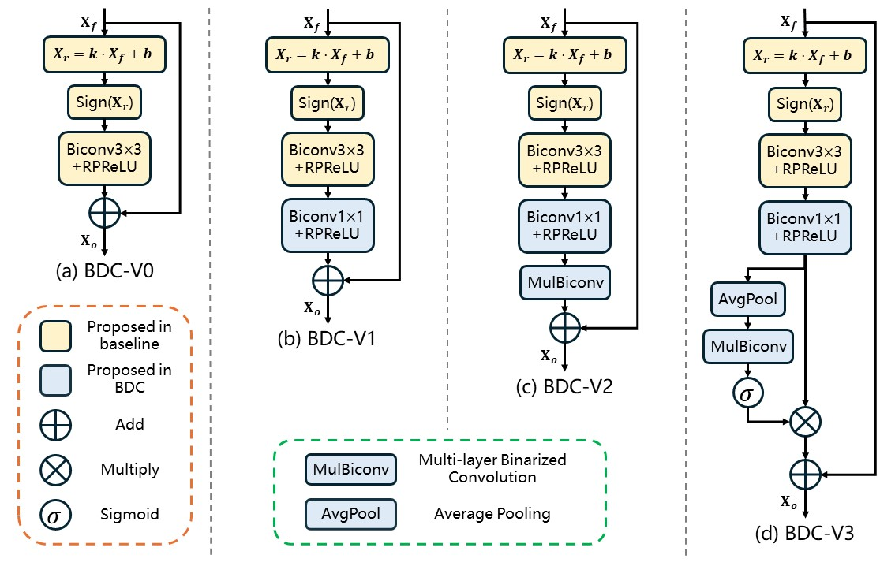

# BDC-Occ: Binarized Deep Convolution Unit For Binarized Occupancy Network


 [Paper] | [Project](https://github.com/zzk785089755/BDC) | [pretrained models]

<hr />


> **Abstract:** *Existing 3D occupancy networks demand significant hardware resources, hindering the deployment of edge devices. Binarized Neural Networks (BNN) offer substantially reduced computational and memory requirements. However, their performance decreases notably compared to full-precision networks. Moreover, it is challenging to enhance the performance of binarized models by increasing the number of binarized convolutional layers, which limits their practicability for 3D occupancy prediction. To bridge these gaps, we propose a novel binarized deep convolution (BDC) unit that effectively enhances performance while increasing the number of binarized convolutional layers. Firstly, through theoretical analysis, we demonstrate that 1 × 1 binarized convolutions introduce minimal binarization errors. Therefore, additional binarized convolutional layers are constrained to 1 × 1 in the BDC unit. Secondly, we introduce the per-channel weight branch to mitigate the impact of binarization errors from unimportant channel features on the performance of binarized models, thereby improving performance while increasing the number of binarized convolutional layers. Furthermore, we decompose the 3D occupancy network into four convolutional modules and utilize the proposed BDC unit to binarize these modules. Our BDC-Occ model is created by applying the proposed BDC unit to binarize the existing 3D occupancy networks. Comprehensive quantitative and qualitative experiments demonstrate that the proposed BDC-Occ is the state-of-the-art binarized 3D occupancy network algorithm.*

<p align="center">
  
</p>

---

##  Dependencies and Installation

- Python >= 3.8 (Recommend to use [Anaconda](https://www.anaconda.com/download/#linux) or [Miniconda](https://docs.conda.io/en/latest/miniconda.html))
- [PyTorch >= 1.10](https://pytorch.org/)


### Installation

1. Clone repo

    ```bash
    git clone git@github.com:zzk785089755/BDC.git
    ```

2. If you want to train or test BDC-Occ for occupancy prediction

    ```bash
    cd BDC-Occ
    ```
    
3. If you want to train or test BDC-Det for 3D object detection

    ```bash
    cd BDC-Det
    ```

**More details please see the README in folder of BDC-Occ and BDC-Det** 

## 📧 Contact

If you have any question, please email `785089755@qq.com`.